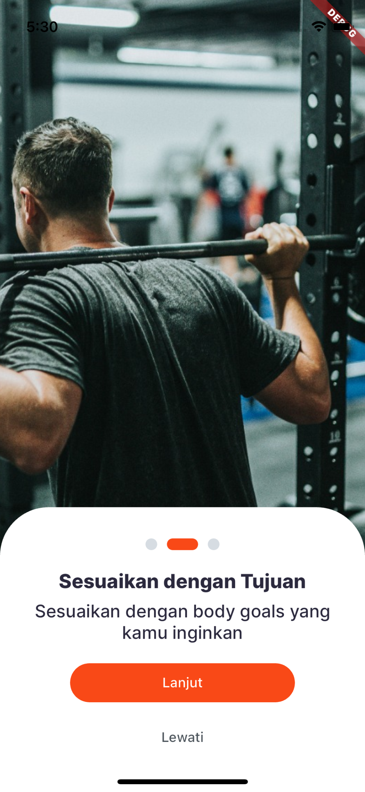
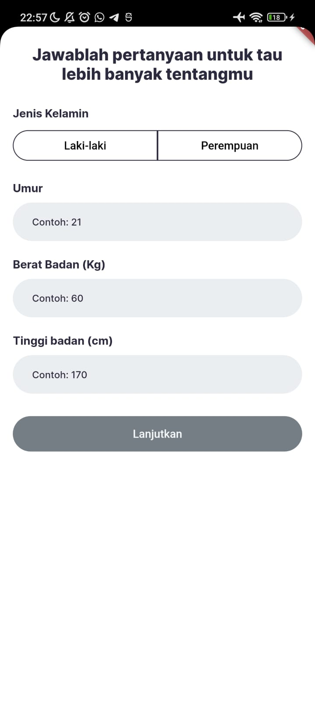
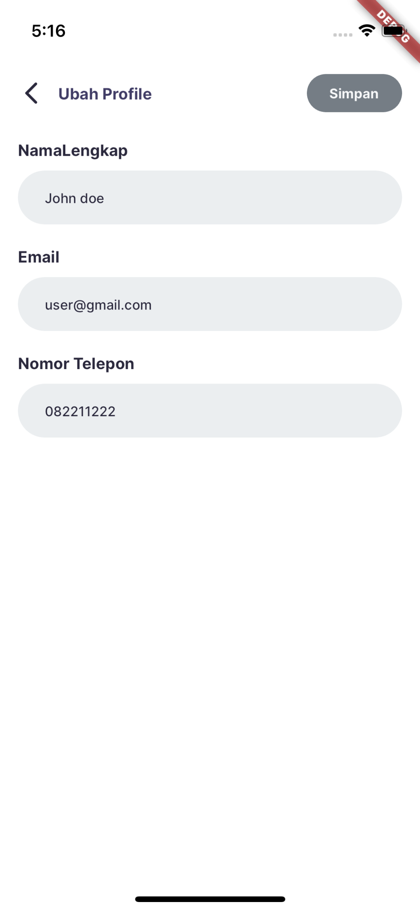

# Kalorize

Kalorize merupakan aplikasi mobile yang memberikan kemudahan bagi aktivis gym dalam mengatur dan mendapatkan menu makan untuk opsi diet. Kalorize memiliki fitur rekomendasi menu makanan berdasarkan preferensi pengguna. Fitur rekomendasi makanan ini berdasarkan kuisioner yang diisi pengguna dan menghasilkan resep makanan yang dapat diakses oleh orang indonesia. data setiap makanan disertakan juga keterangan jumlah kalori dan protein dari setiap makanan. selain itu, pengguna dapat menandai makanan yang akan dimakan untuk sarapan, makan siang dan makan malam setiap harinya. Secara bisnis, aplikasi kalorize menggunakan konsep business to business (b2b) dengan pemiliki gym. Akses aplikasi kalorize secara khusus diperuntukkan kepada anggota gym aktif yang terdaftar pada gym tersebut. Selain itu, kalorize bekerja sama dengan franchise/penjual makanan untuk mempermudah akses pengguna dalam mendapatkan makanan tersebut. App ini dibuat melalui flutter, golang, tensorflow, dan firebase, mysql.

## **Super Team Kalorize**

### **CEO**

Muhammad Syariful Umam - Hipster

### **CMOO - Finance and Tech**

Glorious Satria Dhamang Aji - Hustler / Hacker

### **CTO - Tech and Product**

Abdul Azis Al Ayubbi - Hacker

### **CAIO - Artificial Intellegence and Data**

Agung Hadi Winoto - Hacker

## Installation

Clone project ini

```bash
https://github.com/Azis202017/kalorize.git
```

Mendapatkan dependency

```bash
flutter pub get
```

Menjalankan project

```bash
flutter run
```
Link APK

<a>
https://drive.google.com/drive/folders/1Ak3KQOIQ9Vg4B1r9dA6YMl3yWdnaJtkk

</a>
## Screenshots











# Running Echo Framework Application in Golang

This REcoADME provides instructions on how to run an Echo framework application in Golang on port 8080.

## Prerequisites

Before running the application, make sure you have the following installed:

- Golang: [Download and install Golang](https://golang.org/dl/)
- Echo framework: Install Echo framework by running the following command:
  ```shell
  go get -u github.com/labstack/echo/v4
  ```

## Running the Application

Follow these steps to run the Echo framework application on port 8080:

1. Clone the repository or navigate to the project directory.
2. Build the application by running the following command:

   ```shell
   go build
   ```
3. Start the application by running the following command:

   ```shell
   server.exe
   ```
4. Open your web browser and navigate to `http://localhost:8080` to access the application.

## Configuration

Feel free to change the database configuration in config.yaml.example.
